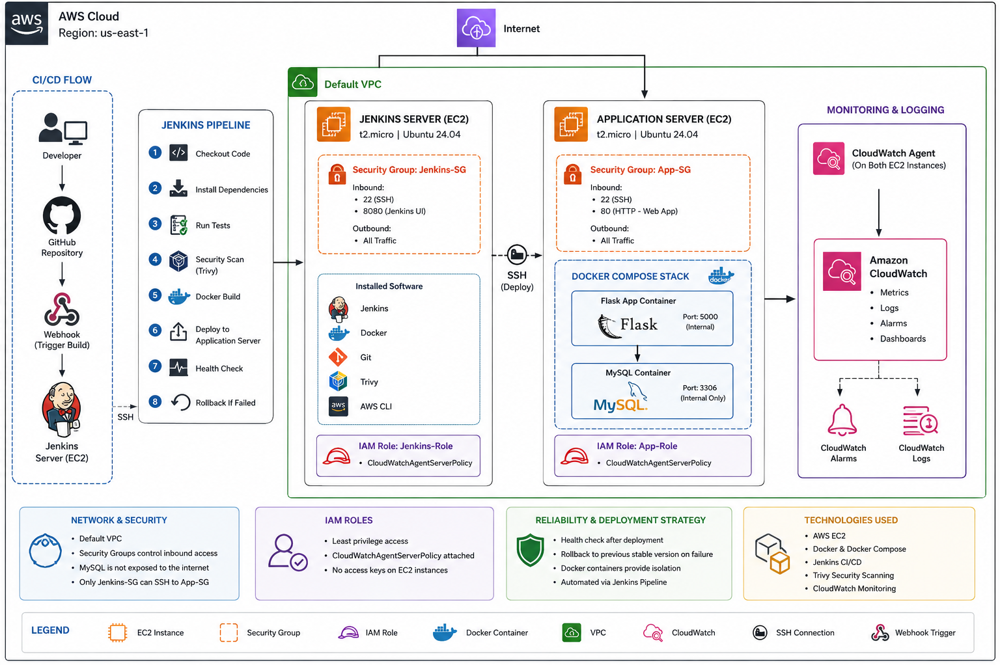
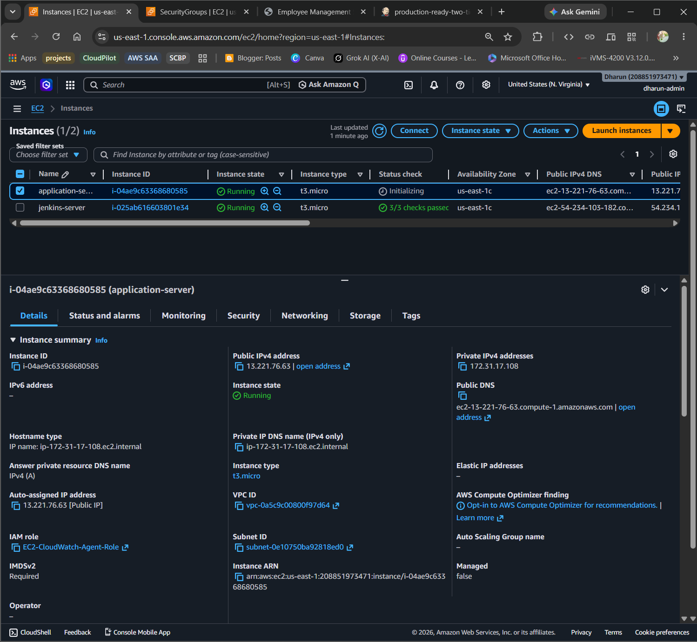
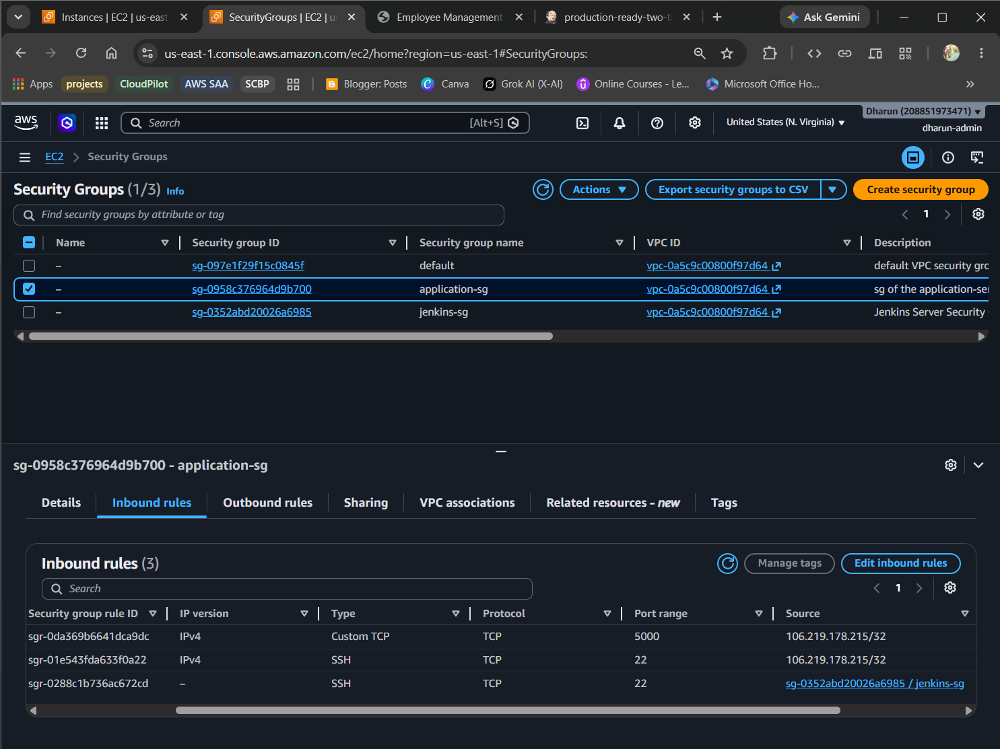
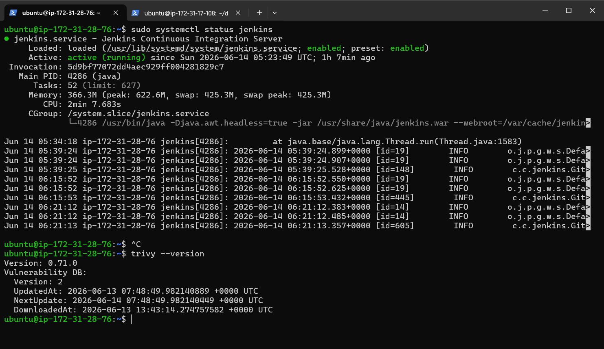
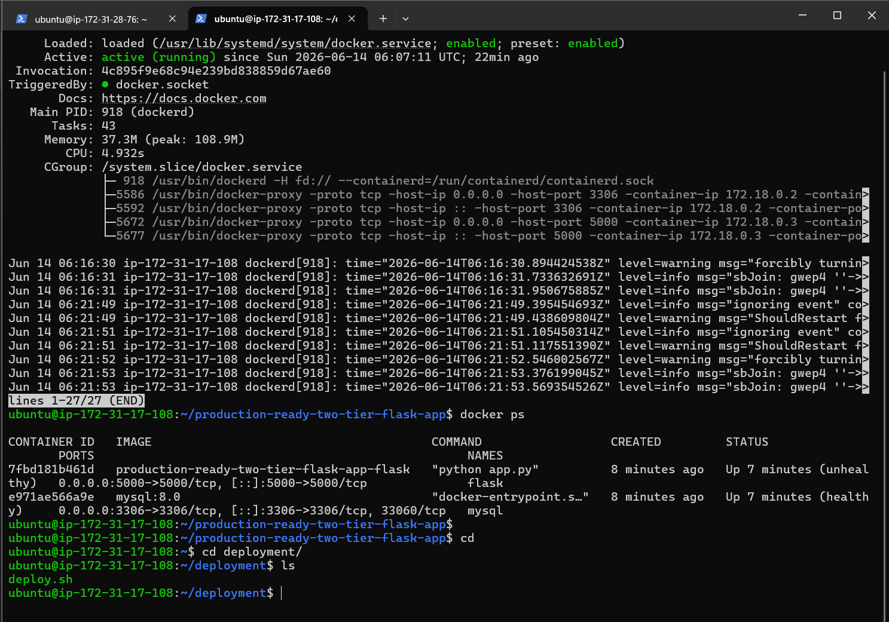
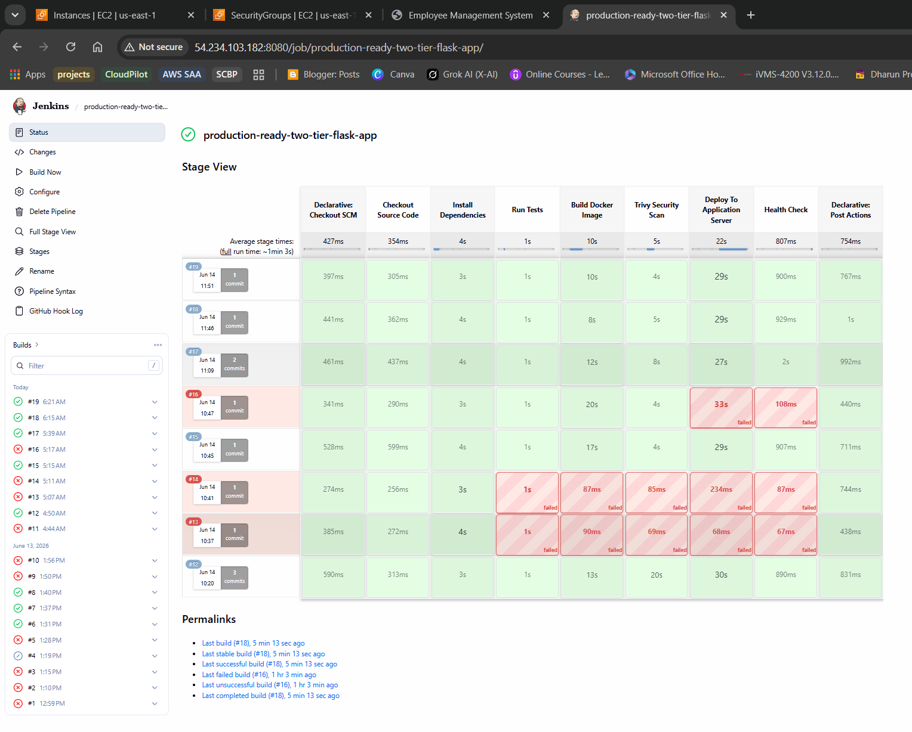
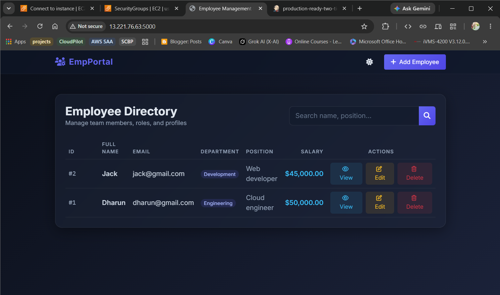

<div align="center">

# 🚀 Production-Ready Two-Tier Web Application with CI/CD

### Automated DevOps Pipeline on AWS — Built from Scratch

[](https://aws.amazon.com/)
[](https://www.jenkins.io/)
[](https://www.docker.com/)
[](https://flask.palletsprojects.com/)
[](LICENSE)

**A fully automated CI/CD pipeline that tests, scans, builds, deploys, and self-heals a Dockerized Flask + MySQL app on AWS — triggered by a single `git push`.**

</div>

---

## 🏆 What This Project Demonstrates

This project was built to showcase **real-world AWS Solutions Architect and DevOps skills** — not tutorials, not labs. Every component here was designed, configured, debugged, and validated hands-on.

| Skill Area | What I Built |
|---|---|
| ☁️ AWS Architecture | Two-tier VPC design with EC2, IAM Roles, Security Groups, CloudWatch |
| 🔁 CI/CD Pipeline | 8-stage Jenkins pipeline triggered automatically via GitHub Webhooks |
| 🐳 Containerization | Dockerized Flask + MySQL with Docker Compose on a production server |
| 🔒 Security | Trivy image scanning, network isolation, least-privilege IAM, no stored access keys |
| 🛡️ Reliability | Automated health checks + automatic rollback on failed deployments |
| 📊 Monitoring | CloudWatch agent on both EC2 instances — CPU, memory, disk metrics |

---

## ☁️ Cloud Architecture

<p align="center">
  
</p>

The architecture runs in **AWS us-east-1** inside a Default VPC with two isolated EC2 instances. Key design decisions:

- **Jenkins-SG → App-SG only** — the Application Server accepts SSH only from the Jenkins Security Group, never from the open internet
- **MySQL is internal only** — the database container is on an isolated Docker network and never exposed outside the server
- **IAM Roles, no access keys** — both EC2 instances use roles with `CloudWatchAgentServerPolicy`. No credentials are stored on disk
- **Dedicated deployment SSH key** — Jenkins gets its own key pair, separate from developer access

---

## 🔁 CI/CD Flow

Every `git push` to `main` triggers this full pipeline — no manual steps:

```
Developer pushes code
         │
         ▼
  GitHub Repository
         │
         │  Webhook
         ▼
  Jenkins Server (EC2)
         │
         ├─ 1. Checkout Code
         ├─ 2. Install Dependencies
         ├─ 3. Run Tests (Pytest)
         ├─ 4. Security Scan (Trivy)
         ├─ 5. Docker Build
         ├─ 6. Deploy via SSH
         ├─ 7. Health Check
         └─ 8. Rollback if Failed
                    │
          ┌─────────┴──────────┐
          │                    │
        PASS                 FAIL
          │                    │
   Production Live      Auto Rollback
                         Previous Version
                         Restored
```

---

## 🛠️ Tech Stack

| Category | Tools |
|---|---|
| Cloud | AWS EC2, IAM, Security Groups, VPC, CloudWatch |
| CI/CD | Jenkins, GitHub Webhooks |
| Containers | Docker, Docker Compose |
| Security Scanning | Trivy (CVE Detection) |
| Backend | Python, Flask |
| Database | MySQL |
| Testing | Pytest |
| Deployment | Bash, SSH Automation |

---

## 📁 Repository Structure

```
production-ready-two-tier-flask-app/
├── app.py                  # Flask application + health endpoint
├── test_app.py             # Pytest automated tests
├── requirements.txt        # Python dependencies
├── Dockerfile              # Container image definition
├── docker-compose.yml      # Flask + MySQL multi-container setup
├── Jenkinsfile             # 8-stage CI/CD pipeline definition
├── .dockerignore
└── templates/              # HTML templates
```

---

## 📖 Implementation Walkthrough

### Step 1 — Provision AWS Infrastructure

Two EC2 instances are launched in the same Default VPC with separate Security Groups designed to limit blast radius.

**Jenkins Server**
```
Name          : jenkins-server
Instance Type : t3.micro
OS            : Ubuntu 26.04 LTS
Storage       : 20 GB
Security Group: Inbound — SSH (22) from My IP | Jenkins UI (8080) from My IP
                Outbound — All Traffic
IAM Role      : Jenkins-Role (CloudWatchAgentServerPolicy)
```

**Application Server**
```
Name          : application-server
Instance Type : t3.micro
OS            : Ubuntu 26.04 LTS
Storage       : 20 GB
Security Group: Inbound — SSH (22) from My IP | HTTP (80) from My IP
                           SSH (22) from Jenkins-SG only
                Outbound — All Traffic
IAM Role      : App-Role (CloudWatchAgentServerPolicy)
```

> ✅ MySQL is NOT in the security group inbound rules — it runs on an internal Docker network only.

<p align="center">
  
</p>

<p align="center">
  
</p>

---

### Step 2 — Set Up Jenkins Server

SSH into the Jenkins server and install all required tools:

```bash
# System update
sudo apt update && sudo apt upgrade -y

# Java (required for Jenkins)
sudo apt install openjdk-21-jdk -y

# Jenkins
curl -fsSL https://pkg.jenkins.io/debian-stable/jenkins.io-2023.key \
  | sudo tee /usr/share/keyrings/jenkins-keyring.asc > /dev/null
echo deb [signed-by=/usr/share/keyrings/jenkins-keyring.asc] \
  https://pkg.jenkins.io/debian-stable binary/ \
  | sudo tee /etc/apt/sources.list.d/jenkins.list > /dev/null
sudo apt update && sudo apt install jenkins -y
sudo systemctl enable jenkins && sudo systemctl start jenkins

# Docker
sudo apt install docker.io -y
sudo usermod -aG docker jenkins   # Allow Jenkins to run Docker without sudo
sudo systemctl restart jenkins

# Python + venv
sudo apt install python3 python3-pip python3-venv -y

# Trivy (container security scanner)
sudo apt install wget apt-transport-https gnupg lsb-release -y
wget -qO - https://aquasecurity.github.io/trivy-repo/deb/public.key \
  | gpg --dearmor | sudo tee /usr/share/keyrings/trivy.gpg > /dev/null
echo "deb [signed-by=/usr/share/keyrings/trivy.gpg] \
  https://aquasecurity.github.io/trivy-repo/deb generic main" \
  | sudo tee /etc/apt/sources.list.d/trivy.list
sudo apt update && sudo apt install trivy -y
```

<p align="center">
  
</p>

---

### Step 3 — Set Up Application Server

```bash
sudo apt update && sudo apt upgrade -y
sudo apt install git docker.io docker-compose-v2 -y
sudo systemctl enable docker && sudo systemctl start docker
sudo usermod -aG docker ubuntu && newgrp docker
```

<p align="center">
  
</p>

---

### Step 4 — Configure SSH Deployment Key

Jenkins deploys to the Application Server over SSH using a dedicated key — no passwords, no shared credentials.

On the Jenkins server (switch to `jenkins` user):

```bash
sudo su - jenkins
ssh-keygen -t rsa -b 4096 -f ~/.ssh/app_deploy_key

nano ~/.ssh/config
# Host app-server
#     HostName <APP_PRIVATE_IP>
#     User ubuntu
#     IdentityFile ~/.ssh/app_deploy_key
#     StrictHostKeyChecking no
```

On the Application Server:

```bash
mkdir -p ~/.ssh
nano ~/.ssh/authorized_keys   # Paste the Jenkins public key here
chmod 700 ~/.ssh && chmod 600 ~/.ssh/authorized_keys
```

Test from Jenkins server:
```bash
ssh app-server   # Must connect without a password prompt
```

---

### Step 5 — Create deploy.sh on Application Server

```bash
mkdir ~/deployment && nano ~/deployment/deploy.sh
```

```bash
#!/bin/bash
set -e

APP_DIR=/home/ubuntu/production-ready-two-tier-flask-app

echo "======================================="
echo "Starting Deployment"
echo "======================================="

if [ ! -d "$APP_DIR" ]; then
    git clone https://github.com/<your-username>/production-ready-two-tier-flask-app.git $APP_DIR
else
    cd $APP_DIR && git pull origin main
fi

cd $APP_DIR
docker compose down
docker compose up -d --build
sleep 20

if curl -f http://localhost:5000/health; then
    echo "======================================="
    echo "DEPLOYMENT SUCCESSFUL"
    echo "======================================="
else
    echo "======================================="
    echo "DEPLOYMENT FAILED — Starting Rollback"
    echo "======================================="
    git reset --hard HEAD~1
    docker compose down
    docker compose up -d --build
    echo "ROLLBACK COMPLETED"
    exit 1
fi
```

```bash
chmod +x ~/deployment/deploy.sh
```

---

### Step 6 — Configure Jenkins Pipeline

1. Open `http://<JENKINS_IP>:8080`
2. Create a new **Pipeline** job
3. Set **Pipeline script from SCM → Git**
4. Repository URL: your GitHub repo
5. Branch: `*/main`

---

### Step 7 — Add GitHub Webhook

In your GitHub repository → **Settings → Webhooks → Add webhook**

```
Payload URL : http://<JENKINS_IP>:8080/github-webhook/
Content Type: application/json
Events      : Just the push event
```

Every `git push` to `main` now automatically triggers the full pipeline.

---

## ✅ Jenkins Pipeline — All 8 Stages

<p align="center">
  
</p>

| Stage | What Happens |
|---|---|
| 1. Checkout Code | Jenkins pulls latest code from GitHub |
| 2. Install Dependencies | Python venv created, `pip install -r requirements.txt` runs |
| 3. Run Tests | `pytest test_app.py` — pipeline stops here if any test fails |
| 4. Security Scan | `trivy image` scans for Critical / High / Medium / Low CVEs |
| 5. Docker Build | Fresh Docker image built from latest code |
| 6. Deploy via SSH | `deploy.sh` executed on Application Server over SSH |
| 7. Health Check | `curl /health` called — must return `{"status": "healthy"}` |
| 8. Rollback if Failed | Auto-reverts to last good commit if health check fails |

---

## 🛡️ Automatic Rollback — Live Tested

This was intentionally tested in production by breaking the `/health` endpoint:

```
Deploy → Health Check → ❌ FAILED
       → Rollback Triggered
       → git reset --hard HEAD~1
       → docker compose down
       → docker compose up -d --build
       → ✅ ROLLBACK COMPLETED
       → Previous stable version restored
```

**Result:** The application was back to the last working version automatically — zero manual intervention.

---

## 🌐 Flask Application — Live on Application Server

<p align="center">
  
</p>

The Flask app runs in a Docker container on the Application Server. MySQL runs in a separate container on an internal Docker network — not accessible from outside the server.

---

## 📊 Monitoring with CloudWatch

CloudWatch Agents are installed on both EC2 instances using IAM Roles (no access keys on disk). The following metrics are sent to Amazon CloudWatch:

- CPU Usage
- Memory Usage
- Disk Usage

Alarms and dashboards can be configured in CloudWatch directly from these metrics.

---

## 🧠 AWS Architecture Decisions

> These decisions reflect Solutions Architect thinking — every choice has a reason.

| Decision | Why |
|---|---|
| Separate Security Groups per server | Blast radius control — App-SG only accepts SSH from Jenkins-SG, never the internet |
| MySQL on internal Docker network | Database never exposed outside the host — no public port binding |
| IAM Roles instead of access keys | AWS best practice — no credentials stored on disk or in environment variables |
| Dedicated deployment SSH key | Jenkins access is isolated from developer keys — follows least-privilege |
| Health check before marking success | Prevents bad deployments from silently going live |
| Automatic rollback in deploy.sh | Reduces MTTR to under 1 minute on deployment failure |

---

## 🐛 Real Problems Solved

These were actual blockers encountered and debugged during the build:

| Problem | Root Cause | Solution |
|---|---|---|
| Jenkins executor waiting — pipeline stuck | Low memory on t3.micro during heavy builds | Workspace cleanup + build optimization |
| Trivy database download failing | Disk quota exceeded on Jenkins server | Trivy cache cleanup + config to limit DB size |
| Python `externally managed environment` error | Ubuntu 26.04 blocks global pip installs | Used explicit venv binary paths in Jenkinsfile |
| Docker permission denied inside Jenkins | Jenkins user not in Docker group | `sudo usermod -aG docker jenkins` + restart |
| SSH deployment failing silently | Key mismatch + StrictHostKeyChecking blocking | Dedicated deploy key + explicit SSH config block |

---

## 💼 Skills Demonstrated

**Cloud & Architecture**
`AWS EC2` `AWS IAM` `IAM Roles` `Security Groups` `VPC` `Amazon CloudWatch` `AWS Free Tier` `Least Privilege Design` `Network Isolation`

**CI/CD & Automation**
`Jenkins` `GitHub Webhooks` `CI/CD Pipelines` `Automated Testing` `Automated Rollback` `SSH Automation` `Bash Scripting`

**Containers**
`Docker` `Docker Compose` `Multi-Container Apps` `Container Networking`

**Security**
`Trivy` `CVE Scanning` `Key-Based Authentication` `No Hardcoded Credentials`

**Backend & Database**
`Python` `Flask` `MySQL` `Pytest` `Health Endpoint Design`

**Linux & Operations**
`Ubuntu Server` `Linux Administration` `Service Management` `Production Debugging`

---
<div align="center">
*Built end-to-end on AWS to demonstrate real-world cloud architecture and DevOps pipeline skills.*
</div>


# 👨‍💻 Author

**Dharun R**

**🚀 Production-Ready Two-Tier Web Application with CI/CD**

---
